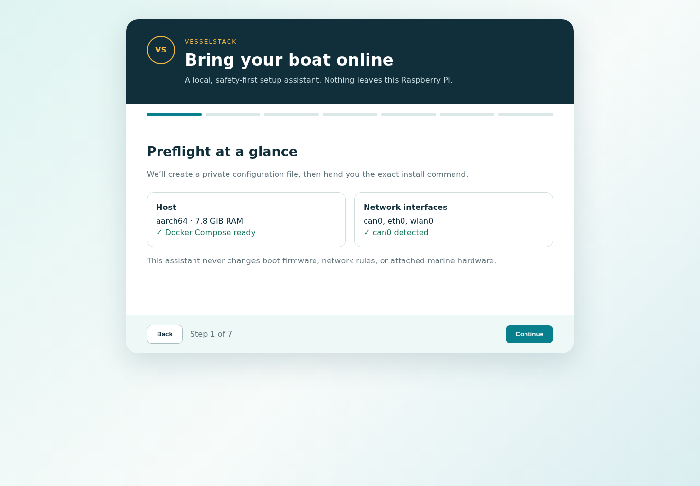
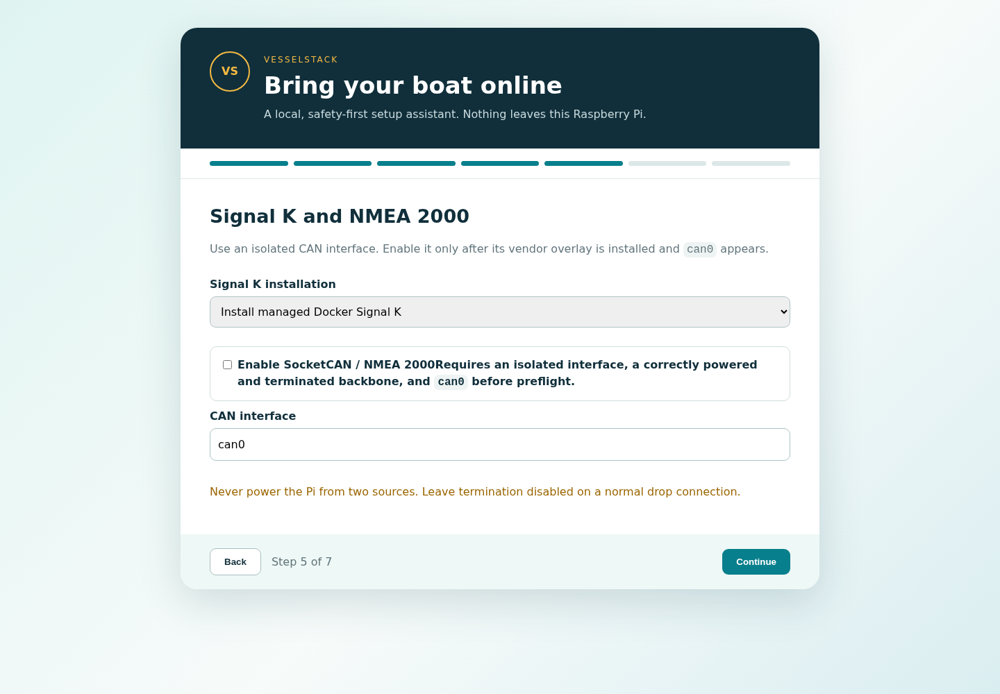

# End-to-end installation

This runbook takes a new Raspberry Pi from unopened hardware to a verified,
recoverable VesselStack installation. Budget a quiet half-day for the first
build; do not commission while underway.

## 1. Plan and buy

Use the [bill of materials](BOM.md). Before ordering the CAN interface, verify:

1. Raspberry Pi 5 support and a current 64-bit Raspberry Pi OS driver/overlay.
2. Galvanic isolation between CAN and the Pi.
3. Mechanical compatibility with the cooler, power hardware, and enclosure.
4. The vessel connector family and the correct drop cable/T-piece.
5. Whether the interface powers the Pi; design exactly one Pi power source.

Record the power circuit, fuse, device model, overlay lines, and rollback in the
boat's electrical documentation.

## 2. Assemble on the bench

Leave the NMEA backbone disconnected. Fit the Active Cooler, CAN interface, and
SSD according to their manufacturers. Check jumper voltage, oscillator, CAN
channel, and termination settings. The reference build uses the isolated NMEA
channel, 3.3 V logic where selectable, and termination **off** for a normal drop.

Use the official Pi supply during bench setup. Do not connect marine power at
the same time.

## 3. Install the operating system

With Raspberry Pi Imager, write the current 64-bit Raspberry Pi OS Lite to the
microSD. In Imager customization, set a unique hostname, non-default user,
strong password, timezone, SSH public key, and Wi-Fi only if needed. Boot with
Ethernet attached, then update once:

```bash
sudo apt update
sudo apt full-upgrade -y
sudo reboot
```

After reconnecting, install prerequisites and Docker Engine/Compose from
Docker's official Debian instructions:

```bash
sudo apt install -y ca-certificates curl git jq openssl python3 python3-venv
docker compose version
```

Create the dedicated account before installer preflight:

```bash
sudo useradd --system --create-home --shell /usr/sbin/nologin boat
id boat
```

## 4. Enable the CAN interface

Follow the exact overlay and jumper instructions for the selected interface;
VesselStack intentionally does not edit boot firmware. Reboot, then verify:

```bash
ip -details link show can0
```

If `can0` is absent, stop here. Inspect `dmesg`, `/boot/firmware/config.txt`, the
overlay name, oscillator frequency, SPI assignment, and HAT vendor guide. Do
not enable `SOCKETCAN_ENABLE` until this succeeds.

## 5. Download and run the wizard

```bash
git clone https://github.com/jclima/VesselStack.git
cd VesselStack
git checkout v1.3.0
python3 vesselstack-wizard.py
```

On the Pi itself open `http://127.0.0.1:8088`. For a headless Pi, keep the
wizard loopback-only and tunnel it from your workstation:

```bash
ssh -L 8088:127.0.0.1:8088 YOUR_USER@YOUR_PI
```

Then open `http://127.0.0.1:8088` locally. The assistant inventories the host,
walks through the BOM and deployment choices, and writes `vesselstack.env` with
mode 600. Stop it with Ctrl-C when finished.





## 6. Preflight, install, and start

Review the generated file without sharing it publicly:

```bash
sudo ./install.sh --config vesselstack.env --dry-run
sudo ./install.sh --config vesselstack.env
sudo ./install.sh --config vesselstack.env --start
sudo vesselstackctl doctor
sudo vesselstackctl urls
```

The dry run must pass before installation. If Docker access is denied, follow
the Docker post-install guidance or run the documented commands with `sudo`.

## 7. Connect and commission NMEA 2000

Power down the Pi and the NMEA backbone. Connect one drop cable to a T-piece on
the existing backbone. Confirm the backbone already has two end terminators and
the new interface's terminator is off. Restore backbone and Pi power, then:

```bash
ip -statistics link show can0
sudo vesselstackctl status
```

In Signal K, add an NMEA 2000/SocketCAN connection using `can0`. Confirm RX
packets increase and expected navigation values appear. A rising error or
dropped counter is a wiring, bitrate, termination, power, or interface problem;
disconnect the new drop and correct it before proceeding.

## 8. Configure integrations and acceptance tests

Follow the root README for Home Assistant, Signal K, AIS, Grafana, and Boat Chat.
Before relying on the system:

- Reboot and confirm `sudo vesselstackctl doctor` passes.
- Turn off upstream internet and confirm local dashboards remain available.
- Simulate only safe sensor conditions and verify alarms on every intended
  device. Never create a real flooding, over-temperature, or low-voltage event.
- Run and verify a backup to separate media:

```bash
sudo vesselstackctl backup
sudo vesselstackctl verify-backup /path/to/archive.tar.gz
```

- Record the Pi hostname/IP, fuse location, power isolation point, CAN adapter,
  connector, installed version, backup location, and recovery owner.

## Rollback and recovery

Before NMEA commissioning, rollback is simply: power down, disconnect the new
drop at its T-piece, and restore backbone power. For software rollback, stop the
stack with `sudo vesselstackctl stop`; preserve `/opt/vesselstack-data` and the
latest verified backup. See the README's update, restore, and uninstall sections
before changing or removing persistent data.
